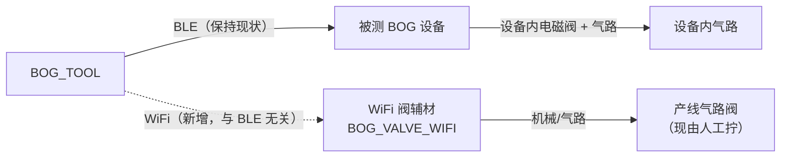
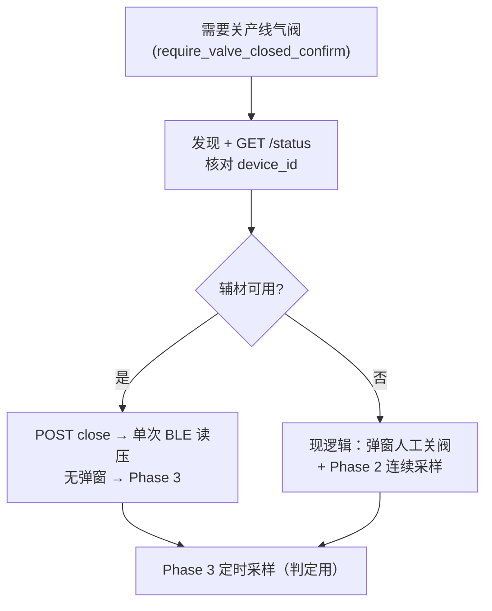

# 产测自动开关阀（WiFi 辅材）规划

> **修订说明**
>
> | 版本 | 结论 | 状态 |
> |------|------|------|
> | v1 | 外接阀 + 继电器（表述不准） | 废弃 |
> | v2 | App 经 WiFi 控 **DUT 本机电磁阀**，替代 BLE 阀控 | **废弃** — 与产品意图不符 |
> | v3 | **独立 WiFi 阀辅材** 控产线气路阀；BLE ↔ DUT 产测不改动 | 边界仍有效 |
> | v3.1 | 查询/开关电磁阀；辅材失败回退人工（后改为 Alert 切换，§4.9） | 边界仍有效 |
> | v3.2 | **HTTP/固件以 `BOG_VALVE_WIFI` 为准**；本文仅 WiFi 辅材与 App 编排/UI | 边界仍有效 |
> | v3.3 | **开测**在 `step_read_pressure` WiFi **开**入口阀；漏气 Phase 2 **关**；拆 DUT 前不 App 自动开 | 边界仍有效 |
> | v3.4 | WiFi 成功不弹窗；中途丢失按 §4.8 | 边界仍有效 |
> | v3.5 | 工位开关 + 失败 Alert 切换 | 边界仍有效 |
> | v3.6 | 局域网 2s 探测失败；整次预算 5s | 边界仍有效 |
> | v3.7 | 独立全局 UI（仿服务器设置） | 边界仍有效 |
> | v3.8 | 产测规则与气阀启用+可用联动（§4.10） | 边界仍有效 |
> | v3.9 | 禁止硬编码：AuxValveSettings + Defaults（§4.11） | 边界仍有效 |
> | **v3.10（本文）** | §4.11.6 审计矩阵；§4.9.2 全键名；补 `postValveSettleSec`/keepalive/缓存 TTL | 当前 |

> **专题分离**：开阀泄漏步骤废除（`step_gas_leak_open`）见 **[`remove-gas-leak-open-step.md`](./remove-gas-leak-open-step.md)**，本文不展开。

**文档分工**

| 主题 | 权威文档 |
|------|----------|
| HTTP 字段、状态码、curl 示例 | [`../BOG_VALVE_WIFI/docs/API.md`](../BOG_VALVE_WIFI/docs/API.md) |
| LED、阀脉冲、NVS、fail-safe | [`../BOG_VALVE_WIFI/docs/FIRMWARE.md`](../BOG_VALVE_WIFI/docs/FIRMWARE.md) |
| 配网、链路测试、App 集成要点 | [`../BOG_VALVE_WIFI/docs/TESTING.md`](../BOG_VALVE_WIFI/docs/TESTING.md)（§四） |
| WiFi 产线边界、回退、BOG_TOOL 模块/UI/阶段 | **本文** |
| 废除 `step_gas_leak_open`、漏气 SOP 仅 closed | **[`remove-gas-leak-open-step.md`](./remove-gas-leak-open-step.md)** |

本地固件仓库：`../BOG_VALVE_WIFI`（与 `BOG_TOOL` 同级，ESP-IDF ESP32-C3）。

**前提**：漏气产测编排对象仅为 **`step_gas_leak_closed`**（见 [`remove-gas-leak-open-step.md`](./remove-gas-leak-open-step.md)）。

---

## 1. 问题与目标

### 1.1 产线现状（两条独立链路）



| 链路 | 作用 | 改动范围 |
|------|------|----------|
| **BLE → DUT** | 连接、压力/Gas、DUT 内阀（`setValve`）、OTA、漏气步骤 BLE 采样 | **不改** |
| **WiFi → 辅材** | 产线气路阀开/关，替代 Phase 2 人工拧阀 | **BOG_TOOL 编排 + 工位设置 UI**（待实现） |

### 1.2 痛点

产测 `step_gas_leak_closed` 在 `require_valve_closed_confirm: true` 时，Phase 2 弹窗要求操作员**手动关闭气路阀**再点确认（`debug.gas_leak_valve_closed_*`）。墙钟记入 `gasLeakClosedUserActionSeconds`，节拍慢且不一致。

**注意**：DUT 内电磁阀仍由 BLE（如 `ensureValveState`）；与产线气路阀**不是同一物件**。

### 1.3 目标

1. 产线使用 **BOG_VALVE_WIFI** 辅材固件（**P0 已完成**，见 §7）。
2. **开测时**保证产线**入口阀打开**（WiFi `open` 或人工已开）；**漏气 Phase 2**再 **关**入口阀。
3. BOG_TOOL 经 WiFi 控制该辅材，缩短人工拧阀时间（开、关两处编排，见 §4.7、§4.4）。
4. **BLE 产测零侵入**：不改 `BLEManager` / GATT / DUT 阀逻辑。
5. 辅材：**查询气阀状态** + **开/关**（HTTP，见固件 API.md）。
6. 自动阀失败 → **Alert 提醒切换** + 人工确认（§4.9）；**不**挡产测、**不** Fail 整轮。

---

## 2. 系统边界（必须遵守）

| 原则 | 说明 |
|------|------|
| **BLE 与 WiFi 无关** | 两通道、两设备；无「WiFi 失败则用 BLE 关产线阀」 |
| **DUT 阀 ≠ 辅材阀** | DUT 阀：BLE；产线气路阀：仅 WiFi 辅材 |
| **HTTP 契约** | 以 **`BOG_VALVE_WIFI/docs/API.md`** 为准，本文不重复维护字段表 |
| **实现状态** | 固件与 Mac 链路脚本 **已有**；BOG_TOOL App/UI **待 P2** |
| **入口阀编排** | **`step_read_pressure`**：确保**开**；**`step_gas_leak_closed` Phase 2**：**关**（废除 open 漏气步骤见另文） |
| **拆 DUT 前** | **不**在 App 内自动开阀（§8.2）；入口阀应由工艺/操作员在拆线前打开，避免憋气浪费 |

---

## 3. WiFi 阀辅材（固件）— 摘要 + 外链

> 详细行为、引脚、验收清单见固件仓文档。本节只列 **App 集成必须知道** 的要点。

### 3.1 已实现能力（对照 FIRMWARE.md）

| 能力 | 要点 |
|------|------|
| LED | 离线常亮（实现为**红**）；配网/连接中**蓝闪**；STA 在线**绿** |
| 按键 | 长按 ≥3s：关阀 → 清 `ssid`/`pass` → SoftAP `BOG-VALVE-{device_id}`（开放） |
| 发现 | mDNS `_bogvalve._tcp`，实例 `BOG-VALVE-{device_id}`，端口 **12306** |
| 身份 | **`device_id`** = WiFi MAC 后 4 位大写 hex（如 `A1B2`），**工位绑定 ID，不绑定 IP** |
| 阀动作 | **150ms** 脉冲，HTTP **同步**返回；典型 `elapsed_ms` ≈ 0.2–0.5s |
| Fail-safe | STA 离线 **60s** 或 HTTP 空闲 **60s** → 自动关阀脉冲 |
| 扩展 | `/pressure` 气压（mbar）；**产测 v1 可不接**，失败不挡产测 |

### 3.2 配网（无 App 内 Captive Portal）

1. 连接辅材 SoftAP `BOG-VALVE-XXXX`（网关多为 `192.168.4.1`）。
2. `POST /api/v1/provision`：`ssid`、`psk`、建议 `token`（32 hex）。
3. 重启后 STA + mDNS；Mac 验证：`tools/bog_valve_link_test.py`（见固件 `tools/README.md`）。

App **v1 不做**自动弹浏览器配网；工位一次性 curl / 脚本即可。

### 3.3 HTTP API — 不在此重复

**完整接口**：[`BOG_VALVE_WIFI/docs/API.md`](../BOG_VALVE_WIFI/docs/API.md)

**App 必遵（相对 v3.1 规划的变化）**

| 项 | 要求 |
|----|------|
| `POST /valve` |  body **必须**含 `"device_id":"A1B2"`，与目标辅材一致 |
| 错设备 | HTTP **409** `error: wrong_device` → 视为辅材不可用 → §4.9 Alert + 人工 |
| 鉴权 | 已配 token 时 Header `X-Device-Token`；401 → 不可用 |
| 到位判定 | `POST` 返回 `ok:true` 且 `valve` 为目标；必要时短轮询 `GET /status`（`moving`） |
| 互斥超时 | 固件 `VALVE_HTTP_TIMEOUT_MS` = **8s**（排队/锁），非阀行程 8s |
| 禁止字段 | 辅材 API 不得出现 BLE/GATT/DUT 阀语义 |

**产测关阀最小序列**（与 TESTING.md §四一致）

1. mDNS 解析当前 IP（或工位缓存 IP 作首轮探测）。
2. `GET /status` → 确认 `device_id == 工位 targetDeviceId`。
3. `POST /valve` `{"action":"close","device_id":"…"}`。
4. 失败/超时/409/401 → §4.9：**Alert 提醒切换** → 人工确认弹窗；**不**因辅材 Fail 整轮产测。

### 3.4 固件验收（P0）

- [x] WiFi STA + SoftAP + HTTP + mDNS（见 `BOG_VALVE_WIFI/README.md`）
- [x] `bog_valve_link_test.py` 发现 + open/close + `device_id`
- [ ] 产线 P2 整机气路 + 与 DUT 并行产测回归（§6）

---

## 4. BOG_TOOL — 集成与 UI（不碰 BLE）

> **App 代码与 UI 待实现**；以下为已对齐固件与 UI 讨论的规格。

### 4.1 模块（命名示例）

| 模块 | 职责 |
|------|------|
| `AuxValveSettings` | 全局配置唯一入口（§4.11）：持久化、运行时读取、**无业务魔法数** |
| `AuxValveSettingsDefaults` | 仅存放**出厂默认**常量（单文件）；实现时禁止在 View/Coordinator 写 `2.0` / `500` |
| `AuxValveWiFiDiscovery` | `NWBrowser` `_bogvalve._tcp`；匹配 `BOG-VALVE-{targetDeviceId}`；缓存 IP 仅作加速 |
| `AuxValveWiFiClient` | 封装 API.md：`/health`、`/status`、`POST /valve`（含 `device_id`） |
| `AuxValveCoordinator` | 发现 → 校验 ID → close/open → 成功/不可用枚举 |
| `AuxValveSettingsView` | 独立 Sheet 配置页（见 §4.6） |
| `AuxValveStatusFooter` | 主界面/产测底部可点击状态条（仿 `ServerStatusFooter`） |

**调用点**（两处，均薄封装，不改 BLE 漏气判定内核）：

| 步骤 | 入口阀动作 |
|------|------------|
| **`step_read_pressure`**（建议） | 压力步骤**开始前** → WiFi **`open`**（或回退现有人工确认，见 §4.7） |
| **`step_gas_leak_closed` Phase 2** | WiFi **`close`**（或回退关阀弹窗，见 §4.4） |

`runProductionGasLeakStep` 内 BLE 采样/判定 **不改**。

### 4.2 辅材可用性判定

1. 若 `enabled == false` 或本台已选「改用手动阀」（§4.9 会话覆盖）→ **不发起 HTTP**，走人工。
2. mDNS 浏览（`discoverTimeoutSec`）或缓存 IP 探测（`probeTimeoutSec`）→ `GET /status`。
3. `ok == true` 且 `device_id == targetDeviceId`；token 正确。
4. `POST /valve`（open/close）成功且 `valve` 到位（`moving` 轮询见 §4.9.2）。
5. 整次 `ensureOpen` / `ensureClose` 墙钟不超过 `operationBudgetSec`，否则视为失败。

**视为不可用**（仅日志，§4.3）：

- 发现超时、无服务、不可达、非 2xx  
- `ok: false`、`401`、`409 wrong_device`  
- close 超时或仍为 `moving`  

### 4.3 成功无确认 / 失败提醒切换

**辅材是增强，不是硬依赖**；整轮产测 **不因** 辅材失败而 Fail。

**已决 — WiFi 路径成功则不弹窗**

| 原则 | 说明 |
|------|------|
| 状态即确认 | `GET /status` + `POST` 到位后，**不**再弹「请确认已开/已关」 |
| read_pressure | `ensureLineValveOpen` 成功 → **不**调用 `pressure_pipeline_ready_*` |
| gas_leak Phase 2 | `tryClose` 成功 → **不**调用 `gas_leak_valve_closed_*` |
| 成功日志 | 可选一行：`aux valve open/close ok` |

**已决 — 工位已开自动阀但调用失败：先 Alert「切换」，再人工工序弹窗**

与「成功不弹窗」不矛盾：失败时要让产线**立刻知道该改用手拧阀**，而不是无声退回。

| 步骤 | 失败时（`enabled==true` 且未会话覆盖） |
|------|----------------------------------------|
| 1 | **Alert**（非阻塞产测结果）：超时 / 不可达 / 401 / wrong_device / 未到位；文案含原因与已耗时 |
| 2 | 按钮见 §4.9（本台改手动 / 重试一次 / 关闭自动气阀） |
| 3 | 选定后 → **现网**人工确认弹窗（读压或关阀），继续 BLE |

`enabled == false` 时：**从不**调 WiFi，**从不**出 Alert，与今天完全一致。



| 场景 | App 行为 |
|------|----------|
| `enabled==false` 或本台已选手动 | 不调 WiFi；仅人工弹窗 |
| 自动阀失败（§4.9） | **Alert 切换** → 人工弹窗；**不** Fail 产测 |
| 自动阀成功 | **无** 工序确认弹窗 |
| `require_valve_closed_confirm: false` | 漏气步骤不调 WiFi、不弹关阀窗（与现逻辑一致） |

### 4.4 与漏气步骤时序（`step_gas_leak_closed` Phase 2）

每跑 **一次** 关阀泄漏步骤、且工位自动阀成功时：入口阀 WiFi **至多 1× `POST /valve` close**（`require_valve_closed_confirm: true`）。

**与现 `betweenSamples` 行为对齐（P2b 约定）**

| 路径 | 现行 App（人工关入口阀） | WiFi 自动关阀（建议） |
|------|------------------------|----------------------|
| 入口阀 | 弹窗 + 人拧阀并确认 | `POST close`，无弹窗 |
| Phase 2 期间 BLE | `while !userResponded` 按 `interval` **连续**采样 → `betweenSamples` | **不**跑长循环；关阀到位后 **各读一次** 关阀/开阀压力（+ 阀门/Gas），可选写入 **1 个** `betweenSamples` 点 |
| 判定 | **不**用 `betweenSamples`；通过/失败看 **Phase 3** 的 `phase2Samples` 最低值 | **相同** — 单次 Phase 2 读不影响判定公式 |
| `gasLeakClosedUserActionSeconds` | 等人 + 确认墙钟 | ≈ WiFi 关阀耗时（~0.2–2s） |

建议序列（辅材成功时）：

1. Phase 1 结束（不变）。  
2. `GET /status` → `POST /valve` close → 确认 `valve == closed`。  
3. 调用与现码相同的 BLE 读：`readPressure` + `readPressureOpen` + `readValveState` + `readGasSystemStatus`，**自适应 settle**（复用 `readGasLeakSensorsAndWait` / `GasLeakPhaseTiming`）。  
4. 可选：追加 **1 条** `betweenSamples`（`phase: 2`，`t ≈ preDur`）便于上传曲线与人工路径一致；**不必**按 `interval` 轮询。  
5. 直接进入 **Phase 3** 定时采样（`phase2Samples`，逻辑不变）。

**不建议** WiFi 成功后仍跑整个人工 `while` 循环（无确认框时循环无意义，且拖长节拍）。关阀后至 BLE 读压前的短等待使用 **`postValveSettleSec`**（§4.11.1），禁止在 `ProductionTestView` 写 `0.6` / `1.0`。

| 阶段 | 辅材可用 | 回退 |
|------|----------|------|
| Phase 1 后关产线阀 | `GET /status` → `POST close` + `device_id` | 原弹窗 + 人确认 |
| Phase 2 BLE | 关阀后 **单次**双路压力读（上表）；非长循环 | 原 while + 弹窗 |
| Phase 4（DUT 泄压） | **不**规划 WiFi/人工开入口阀（仅 BLE 开 DUT 阀）；见 §8.2 **已决** | 与今天一致 |

### 4.7 开测时确保入口阀打开 — `step_read_pressure`（已决方向）

**工艺**：每轮 SOP 开测时，产线**入口阀（WiFi 辅材或人工阀）须处于打开状态**，气路可进 DUT。默认步骤顺序下 **`step_read_pressure`（order 8）在 `step_gas_leak_closed`（order 10）之前**，适合在此**提前**用 WiFi 开阀。

**建议序列（辅材可用且工位 `enabled`）**

1. 进入 `step_read_pressure` 的 `pressureRetryLoop` **之前**（或与现「气路确认」合并）：  
   - `GET /status` → 若已是 `open` 且 `device_id` 匹配 → **跳过** `POST open`。  
   - 否则 `POST /valve` `{"action":"open","device_id":"…"}` → 轮询至 `open`。  
2. **成功**（§4.3）：**不弹窗**；直接进入 BLE 读压。出口是否已开由工艺/SOP 保证，App 不再用弹窗重复问「入口阀已打开」。  
3. **失败**：§4.9 Alert → 再 `pressure_pipeline_ready_*` 人工确认 → BLE 读压。  
4. 之后压力步骤逻辑 **不变**（先开 DUT 阀读开阀压、再关 DUT 阀读关阀压等）。

**与漏气步骤衔接**

```text
read_pressure:  WiFi open（或人工确认已开）  →  …中间步骤…  →  gas_leak Phase 2: WiFi close
拆 DUT 前:      不在 App 自动 open（§8.2）；若 Phase 2 已关入口阀，由操作员按 SOP 手动开阀再拔 DUT
```

| 项 | 说明 |
|----|------|
| WiFi 次数/轮 FQC | 典型 **1× open**（read_pressure）+ **1× close**（漏气 Phase 2），均仅在辅材可用时 |
| `AuxValveCoordinator` | 增加 `ensureLineValveOpen()` / 复用 `tryOpen`；与 `tryClose` 对称 |
| 固件 fail-safe 60s | 见 §4.8：距上次 HTTP **60s** 辅材可能自动关阀；与「测试中途 WiFi 丢失」需一并考虑 |

### 4.8 测试过程中 WiFi 丢失 / 辅材不可达

**设计前提**：App **不维持**与辅材的长连接；每轮只在 **`step_read_pressure` 开阀**、**`step_gas_leak_closed` Phase 2 关阀** 两个时刻发起发现 + HTTP。中间步骤（连 DUT、读 RTC、漏气 Phase 1/3/4）**只走 BLE**，不依赖 WiFi 在线。

因此「中途丢失」= **下一次**编排调用辅材时失败，或 **固件 fail-safe** 在两次 HTTP 之间把阀关上。产测 **不因辅材掉线而 Fail**（辅材非硬依赖）。

#### 按时刻

| 时刻 | 入口阀实际状态 | App 行为 |
|------|----------------|----------|
| **读压前** `tryOpen` 失败 | 未知 | §4.3：弹 `pressure_pipeline_ready_*`，人工确认后 BLE 读压 |
| **读压前** `tryOpen` 已成功，之后掉线 | 多为仍 **open**（直至 fail-safe 或人拧） | 中间步骤 **不检测** WiFi；继续 BLE |
| **漏气 Phase 2** `tryClose` 失败 | 可能仍 open，或 fail-safe 已 **closed** | §4.3：弹 `gas_leak_valve_closed_*`，人工确认关阀 → **单次** BLE 读压 → Phase 3（与现网一致） |
| **漏气 Phase 2** 已成功关阀，之后掉线 | **closed** | Phase 3/4 **仅 BLE**，无需 WiFi；**不**弹窗、**不** Fail |
| **整轮结束** | 常为 closed | 拆 DUT 前人工开入口阀（§8.2），与 WiFi 无关 |

#### 固件 fail-safe（与「丢 WiFi」叠加）

辅材在 **STA 离线 60s** 或 **任意 HTTP 空闲 60s** 后会 **自动关入口阀**（安全位）。典型风险：

- `read_pressure` 已 `POST open`，到漏气 Phase 2 再发 HTTP 若 **间隔 >60s**（中间 BLE 步骤慢、重试多），阀可能在中途被辅材关上。
- 对漏气：关阀通常是期望态，Phase 2 可能 `GET` 已是 `closed` 而跳过 `POST`，**不挡产测**。
- 对读压后、漏气前若工艺要求入口常开：宜 **工位辅材网络稳定**；P2b **可选** keepalive：`keepaliveEnabled` + `keepaliveIntervalSec`（§4.11.1），禁止写死 45s。**v1 默认** `keepaliveEnabled=false`。

#### App 禁止行为

- **不**因中途掉线弹出「WiFi 断开」阻断产测（仅 debug 日志 / 上报可选字段）。
- **不**在 Phase 3/4 因辅材不可达而重试关阀或改 BLE 判定。
- **不**假设「上一轮 open 成功则本轮 close 一定可达」— Phase 2 **必须**重新发现 + `GET /status` + `POST close`（或回退人工）。

#### 回归（P2b）

| 用例 | 期望 |
|------|------|
| 读压 open 成功后拔辅材网线，至漏气 Phase 2 | `tryClose` 失败 → 人工关阀弹窗 → 漏气逻辑与现网一致 |
| Phase 2 WiFi 关阀成功后断网，跑完 Phase 3/4 | 无额外交互，BLE 结果正常 |
| 工位 `enabled=false` | 全程与现网一致，不访问辅材 |
| open 后 **>60s** 无 HTTP 再进漏气 | 辅材可能已关阀；Phase 2 以 `status` 为准，不 Fail 产测 |
| 自动阀探测/HTTP 超时（`discoverTimeoutSec` 等） | Alert（§4.9）；选「本台改手动」后同轮不再调 WiFi |

### 4.9 产线开关 + 调用超时（已决方向）

#### 4.9.1 人工阀 vs WiFi 阀 — 工位开关（**同意，必做**）

即使辅材在线、配网正常，产线也须能 **显式选择** 本工位是否走自动阀。

| 项 | 规格 |
|----|------|
| 持久化字段 | `AuxValveSettings.enabled`（建议 UI 文案：**「使用 WiFi 自动气阀」**） |
| `false` | **人工阀模式**：不 mDNS、不 HTTP；读压/漏气仅用现网确认弹窗 |
| `true` | **自动阀模式**：读压前 `open`、漏气 Phase 2 `close`；成功无确认弹窗 |
| 默认 | **`false`**，避免未配网工位误连 |
| 可见性 | 底栏 + Sheet 主开关；产测规则页 §4.10 **联动**（自动模式下锁定 `require_*_confirm`） |
| 与规则 JSON | **不**写入 `ProductionRules`；属工位级，换 Mac/工位独立 |

辅材「硬件可用」≠ 本班必须用 WiFi；夜班辅材故障时操作员关开关即可，无需改 JSON。

#### 4.9.2 多久无响应算失败 — **全部读 `AuxValveSettings`（已决）**

产测 Mac 与辅材在 **同一局域网**；正常响应为百毫秒级。超时判定**只**比较工位配置与墙钟预算，**数值出厂默认**见 `AuxValveSettingsDefaults`（§4.11.1），文档中的「2s/5s」仅为默认说明，**不是**实现字面量。

| 阶段 | 使用的配置键 | 说明 |
|------|----------------|------|
| mDNS 浏览 | `discoverTimeoutSec` | |
| 缓存 IP 首包 HTTP | `probeTimeoutSec` | |
| `GET /status` | `httpTimeoutSec` | |
| `POST /valve` | `httpTimeoutSec` | 不跟固件 8s 互斥上限 |
| `moving` 轮询 | `movingPollIntervalMs` + `movingPollMaxSec` | |
| 整次 open/close | `operationBudgetSec` | 到点即失败 |
| Alert「重试」次数 | `orchestrationRetryCount` | 禁止写死 `1` |

**实现注意**：`URLSession.timeoutInterval` ← `httpTimeoutSec` / `healthHttpTimeoutSec`；禁止系统默认 60s。

#### 4.9.3 失败 Alert — 「提醒切换」

**触发**：`enabled==true` 且 §4.2/§4.9.2 失败（含无响应、超时、401、409、未到位）。

**不触发**：`enabled==false`；或本台已 `useManualValveForCurrentRun`。

**Alert 示例**（本地化 key 待实现）：

- 标题：`WiFi 气阀不可用`
- 正文：原因 + 已用时间（如「局域网 2 秒内无响应」/「未发现设备 BOG-VALVE-A1B2」）
- 按钮：

| 按钮 | 行为 |
|------|------|
| **本台改用手动阀** | 置 `useManualValveForCurrentRun = true`（仅当前 FQC 会话）；**本步**走人工确认弹窗；**同轮后续**不再调 WiFi |
| **重试** | 再执行至多 `orchestrationRetryCount` 次（每次仍受 `operationBudgetSec` 等配置）；仍失败则回到本 Alert |
| **关闭自动气阀** | `enabled = false` 写 UserDefaults；后续永久人工模式，直到工位再打开 |

Alert 之后 **必须** 进入现网人工工序弹窗（不能静默跳过拧阀确认）。

#### 4.9.4 与 §4.8 中途掉线的关系

- 掉线发生在 **两次编排点之间**：下一编排点按 §4.9.2 超时 → Alert → 人工。
- 掉线发生在 **单次 HTTP 内**：由 `httpTimeoutSec` / 总预算截断，同样走 Alert。
- Phase 3/4 **不** 因掉线弹 Alert（不调辅材）。

### 4.5 明确不做

- 在 View/Coordinator 内 **硬编码** 辅材超时、延迟颜色阈值、健康探测周期（见 §4.11）  
- 改 `BLEManager`、`setValve`、`ensureValveState`、GATT  
- WiFi 控制 DUT 内阀  
- 漏气步骤 BLE 判定公式/阈值改动  
- 固件 API 对接 BOG GATT UUID  
- App 内 SoftAP 配网向导（v1）  
- `ProductionRules` JSON 承载辅材 token（v1 用工位设置；上传快照是否带 `auxValveEnabled` **待定**）

### 4.6 独立全局 UI（仿「服务器设置」）— **已决，必做**

**结论**：电磁阀（WiFi 辅材）配置与服务器上传一样，做成 **工位级全局设定** — 主界面底部 **可点击状态条** + **独立 Sheet**，而不是藏在产测规则 JSON 或某一步弹窗里。

**参照实现**（BOG_TOOL 现网）：

| 服务器 | 电磁阀（规划） |
|--------|----------------|
| `ServerSettings` + `UserDefaults` | `AuxValveSettings` |
| `ServerStatusFooter`（`ContentView` 底部，点击打开） | `AuxValveStatusFooter` |
| `ServerSettingsView` Sheet | `AuxValveSettingsView` Sheet |
| `lastPingLatencyMs` + 绿/黄/红 | `lastHealthLatencyMs` + 同色规则 |
| `performHealthCheck` 周期可配 | `healthCheckIntervalSec` + `healthHttpTimeoutSec`（§4.11.1） |

`AuxValveSettings` 以 `@EnvironmentObject` 注入 `ContentView`、`ProductionTestView`、`DebugModeView`（与 `serverSettings` 同级）。

#### 4.6.1 底部状态条 `AuxValveStatusFooter`

位置：与 **`ServerStatusFooter` 并列**（产测/调试主界面底栏），例如 `服务器 · … | 气阀 · …`。

| 显示（`enabled` 关） | 灰点 +「气阀：关」；无延迟；点击仍开 Sheet |
| 显示（`enabled` 开 + 在线） | 色点 + `BOG-VALVE-{id}` 缩写 + `· {N}ms` |
| 显示（`enabled` 开 + 离线） | 红点 +「离线」/「不可达」 |

**延迟着色**（与服务器一致，便于产线一眼判断 LAN 质量）：

| 条件 | 颜色 |
|------|------|
| 未启用自动气阀 | 灰色（`Color.secondary`） |
| 已启用且可达，`latency ≤ latencyGreenMaxMs` | **绿色**（与 `ServerStatusFooter` 一致） |
| 已启用且可达，`latency > latencyGreenMaxMs` 且 `≤ latencyYellowMaxMs` | **黄色** |
| 已启用但探测失败 / 超时 | **红色** |

文案 key 示例：`aux_valve.footer_label`、`aux_valve.footer_latency`（`%d ms`）、`aux_valve.footer_offline`、`aux_valve.footer_hint`（点击打开设置）。

**交互**：整行 `onTapGesture` → `auxValveSettings.showAuxValveSettingsSheet = true`（同 `serverSettings.showServerSettingsSheet`）。

#### 4.6.2 设置 Sheet `AuxValveSettingsView`

独立窗口，最小尺寸参考 `ServerSettingsView`（约 420×300，可略高以容纳扫描列表）。

| 区块 | 控件 |
|------|------|
| 标题栏 | 「WiFi 气阀设置」+ 关闭 |
| **主开关** | Toggle **「使用 WiFi 自动气阀」** → `enabled`（§4.9.1） |
| 设备 | `targetDeviceId` 文本框（4 位 hex，大写）；**扫描**按钮 → mDNS 列表，点选填入 |
| 鉴权 | `token`（SecureField 或粘贴）；说明见 API.md |
| 高级（可折叠） | §4.11.1 全部超时/延迟阈值/重试次数（**禁止** Sheet 内写死仅展示用数字） |
| 动作 | **测试开阀** / **测试关阀**（Sheet 内执行，显示本次 `elapsed_ms` 与结果） |
| 页脚状态 | 当前 `valve` / `moving` / 最近延迟 / 最近错误（只读，来自 `/status`） |

配网（SoftAP + curl）**不**做进 Sheet v1；页脚链到 `BOG_VALVE_WIFI` 文档或工位 SOP 说明。

#### 4.6.3 后台健康探测

- `enabled == true` 时：Timer 周期 = `healthCheckIntervalSec`，HTTP 超时 = `healthHttpTimeoutSec`（§4.11.1，默认 3s / 2s）。
- 更新 `isAuxValveReachable`、`lastHealthLatencyMs`；供底栏着色与 Sheet 页脚。
- `enabled == false`：停止定时器，底栏灰色，产测不调 HTTP。
- App 启动 / 打开 Sheet 时 `triggerHealthCheck()` 一次（仿 `ServerSettings.triggerHealthCheck`）。

产测编排中的 `ensureOpen`/`ensureClose` **复用同一** `AuxValveWiFiClient`，与探测共用超时配置。

#### 4.6.4 与产测其他 UI 的关系

| 位置 | 行为 |
|------|------|
| 底部 `AuxValveStatusFooter` | **主入口**：配置、启用、看延迟 |
| 产测规则页 | 与 §4.10 **联动**（非仅只读一行） |
| 产测运行失败 | §4.9 Alert；可提供「打开气阀设置」跳转 Sheet（可选） |

**不做**：在每条 `ProductionRules` 步骤里嵌辅材 token；不做 Captive Portal 向导 v1。

### 4.10 产测规则联动（`ProductionTestRulesView`）— **已决**

**结论**：SOP 规则里与「入口阀人工确认」相关的项，必须与全局气阀 **「已启用且当前可用」** 一致；**不能**在 WiFi 自动模式下仍让人改回人工确认，也**不能**在未启用/不可用时误以为走 WiFi。

#### 4.10.1 判定量（单一来源）

在 `AuxValveSettings` 提供（供规则页、产测运行、底栏共用）：

```text
canUseAuxValveAutomation =
    enabled
    && !targetDeviceId.isEmpty
    && isAuxValveReachable    // 最近一次健康探测在 healthHttpTimeoutSec 内成功，见 §4.6.3
```

| 状态 | 含义 |
|------|------|
| `enabled == false` | **人工气阀模式**（全局 UI 未启用） |
| `enabled == true` 且 `!canUseAuxValveAutomation` | **已启用但不可用**（离线/未配 ID/探测失败） |
| `canUseAuxValveAutomation` | **WiFi 自动模式**（规则锁定 + 运行走 WiFi） |

健康探测结果变化时 `NotificationCenter` 通知规则页刷新（仿 `.productionTestRulesDidChange`）。

#### 4.10.2 规则页 UI 行为（`step_gas_leak_closed` 区块）

影响现有两项（`ProductionTestRulesView` `gasLeakParamsSection`）：

| 规则字段 | 人工模式 | 已启用但不可用 | WiFi 自动模式 |
|----------|----------|----------------|---------------|
| `require_valve_closed_confirm` | **可编辑** | **可编辑** | 强制 **`true`**，Toggle **禁用**（灰） |
| `require_pipeline_ready_confirm` | **可编辑** | **可编辑** | 强制 **`false`**，Toggle **禁用**（灰） |

**自动模式锁定原因**（页内说明一行小字即可）：

- 入口 **开**：已在 `step_read_pressure` 由 WiFi 保证（§4.7），Phase 1 前不再要「气路确认」弹窗 → `require_pipeline_ready_confirm = false`。
- 入口 **关**：Phase 2 由 WiFi 关阀（§4.4），仍需 `require_valve_closed_confirm = true` 作为编排开关（触发关阀逻辑），但**不**再弹人工确认（§4.3）。

**`enabled == false`（人工模式）**：

- 上述两项 **可编辑**（产线配置人工 SOP）。
- **禁止**出现「自动模式锁定态」（灰且不可改、但 WiFi 实际未启用）；若未来有「规则内启用 WiFi」类 Toggle，在 `enabled==false` 时该项 **disabled**。
- 横幅（灰）：`请在底栏「气阀」设置中启用 WiFi 自动气阀后，方可使用自动联动规则。`

**`enabled == true` 但不可用**：

- 两项 **可编辑**（按人工 SOP 备援）；横幅（黄）：`WiFi 气阀不可用（离线/超时），当前按人工气阀规则执行。`
- 保存规则时 **不** 强制改写 JSON（避免离线时误锁死模板）。

**`canUseAuxValveAutomation`**：

- 进入规则页 / 收到健康探测更新时：**自动写入**上表强制值到 UI 状态，并 **禁用** 两个 Toggle（**禁止切换**）。
- 用户点「保存规则」时，将强制值写入 `current_production_rules.json`（与模板一致），避免 JSON 与运行时不一致。

#### 4.10.3 运行时与规则一致（`ProductionTestView`）

产测执行 **不得** 只看 `enabled`，必须与规则页同一判定：

| 条件 | `step_read_pressure` | `step_gas_leak_closed` Phase 2 |
|------|----------------------|--------------------------------|
| `canUseAuxValveAutomation` | `ensureLineValveOpen()`，成功无弹窗 | `tryClose()`，成功无弹窗 |
| `enabled && !reachable` | §4.9 Alert → 人工弹窗 | 同上 |
| `!enabled` | 始终 `pressure_pipeline_ready_*` | `require_valve_closed_confirm` 为 true 时人工弹窗；为 false 则与现网一致 |

`require_valve_closed_confirm == false` 时：即使 `canUseAuxValveAutomation`，也**不**调 WiFi（与现网一致）；规则页在自动模式下已强制为 true，正常产线不会落在此组合。

#### 4.10.4 Debug 模式（可选 P2c）

`DebugModeView` 漏气参数 **复用同一联动**（`LeakTestKeys` 与产测规则对齐），避免调试与 FQC SOP 两套逻辑。

#### 4.10.5 上传追溯（待定 §8）

上报 `rules` 快照时建议增加（可选）：

- `aux_valve_enabled`（工位）
- `aux_valve_reachable_at_run`（开测时一次探测）
- `aux_valve_automation_used`（本台是否曾走 WiFi 开/关成功）

#### 4.6.5 实施顺序（P2a / P2b）

| 阶段 | 内容 |
|------|------|
| **P2a** | `AuxValveSettings` + `AuxValveWiFiDiscovery/Client` + `AuxValveSettingsView` + `AuxValveStatusFooter` + 注入 `BOG_TOOLApp` / `ContentView` |
| **P2b** | 产测 `ensureOpen`/`ensureClose` + §4.9 Alert + §4.10 规则联动 |
| **P2c** | Debug 模式复用同一 `EnvironmentObject`（可选） |

**默认**：`enabled = false`（来自 `AuxValveSettingsDefaults`，非 View 内字面量）；完成配网并在 Sheet 内测试开/关通过后，由工位班长打开主开关。

### 4.11 禁止硬编码 — 参数来源（**已决，P2 必守**）

**要求**：WiFi 气阀与产测编排涉及的**可调参数**，不得在 `ProductionTestView` / `ProductionTestRulesView` / `AuxValveCoordinator` 等处以魔法数散落；仅允许 **（1）工位配置 `AuxValveSettings`**、**（2）产测规则 JSON `ProductionRules`**、**（3）固件/协议常量（只读，注明出处）**。

#### 4.11.1 工位配置 `AuxValveSettings`（UserDefaults）

所有项带 **合理范围校验**（Sheet 保存时 clamp），并可在「高级」区编辑（§4.6.2）。

| 键（示例） | 含义 | 出厂默认（仅 `AuxValveSettingsDefaults`） | 允许范围（示例） |
|------------|------|------------------------------------------|------------------|
| `enabled` | 使用 WiFi 自动气阀 | `false` | bool |
| `targetDeviceId` | 绑定辅材 ID | `""` | 4 hex |
| `token` | `X-Device-Token` | `""` | 字符串 |
| `discoverTimeoutSec` | mDNS 浏览超时 | `2.0` | 1–5 |
| `probeTimeoutSec` | 首包 HTTP（发现后） | `2.0` | 1–5 |
| `httpTimeoutSec` | 单次 GET/POST | `2.0` | 1–10 |
| `operationBudgetSec` | 整次 open/close 墙钟上限 | `5.0` | 2–20 |
| `movingPollIntervalMs` | `moving` 轮询间隔 | `200` | 100–1000 |
| `movingPollMaxSec` | `moving` 轮询总时长 | `1.0` | 0.5–5 |
| `healthCheckIntervalSec` | 底栏健康探测周期 | `3.0` | 2–30 |
| `healthHttpTimeoutSec` | 健康探测 HTTP 超时 | `2.0` | 1–10 |
| `latencyGreenMaxMs` | 底栏绿色上限 | `500` | 100–2000 |
| `latencyYellowMaxMs` | 底栏黄色上限（≥绿） | `2000` | 500–5000 |
| `orchestrationRetryCount` | 产测开/关阀失败后 Alert 内「重试」次数 | `1` | 0–3 |
| `postValveSettleSec` | WiFi 关/开阀到位后、BLE 读压前等待 | `0.6` | 0–3 |
| `keepaliveEnabled` | 漏气 Phase 1 是否刷新 HTTP 空闲计时 | `false` | bool |
| `keepaliveIntervalSec` | keepalive `GET /health` 间隔 | `45.0` | 10–55（须 &lt; 固件 60s fail-safe） |
| `cachedEndpointTtlSec` | mDNS 解析 IP 缓存 TTL | `300` | 60–600 |
| `useManualValveForCurrentRun` | 本台会话强制人工（§4.9） | `false` | bool，会话级 |

**读取方式**：`AuxValveWiFiClient` / `AuxValveCoordinator` / `AuxValveStatusFooter` / `ProductionTestView` **只**通过 `auxValveSettings.*` 取值。

**缓存 IP**：`cachedEndpointTtlSec`；禁止 Coordinator 内 `300` 字面量。

#### 4.11.2 产测规则 JSON（`ProductionRules` / `default_production_rules.json`）

以下**继续只来自规则 JSON**，WiFi 功能**不得**在 Swift 里写死阈值/时长：

| 来源 | 示例 |
|------|------|
| `step_read_pressure` | `closed_min_mbar`、`open_max_mbar`、`pressure_read_timeout_seconds`… |
| `step_gas_leak_closed` | `pre_close_duration_seconds`、`interval_seconds`、`drop_threshold_mbar`、`require_valve_closed_confirm`、`require_pipeline_ready_confirm`… |
| `step_disable_diag` | `valve_check_*` |

§4.10 自动模式下对 `require_*_confirm` 的**强制 true/false** 属于**业务规则**（由 `canUseAuxValveAutomation` 推导），不是可调参数；强制结果**写回**规则 JSON 时再持久化。

漏气 BLE 采样、判定、Phase 3/4 时长：**零改动**；WiFi 仅包裹入口阀开/关外层。

#### 4.11.3 协议/固件常量（允许存在，须集中标注）

下列**不是**工位可调项，集中在 `AuxValveProtocol`（或 `AuxValveSettingsDefaults` 旁注释 **Protocol**，勿散落）：

| 常量 | 值 | 说明 |
|------|-----|------|
| mDNS 服务类型 | `_bogvalve._tcp` | API.md |
| 默认 HTTP 端口 | `12306` | 以 mDNS TXT / API.md 为准；若 TXT 带端口则**用 TXT，非写死 IP:12306** |
| API 路径前缀 | `/api/v1` | API.md |
| `POST /valve` body | `action` + `device_id` | API.md |

固件 **150ms 阀脉冲**、**60s fail-safe** 属辅材行为，App **不硬编码**；仅文档与工艺知晓。

#### 4.11.4 实现检查清单（Code Review）

- [ ] `grep` 产测/辅材模块无裸字面量 `2.0` / `5.0` / `500` / `3.0`（除 `AuxValveSettingsDefaults` 一处）
- [ ] `URLSessionConfiguration.timeoutIntervalForRequest` 来自 `settings.httpTimeoutSec`
- [ ] 底栏颜色比较用 `settings.latencyGreenMaxMs` / `latencyYellowMaxMs`
- [ ] `Timer` 间隔用 `settings.healthCheckIntervalSec`
- [ ] 规则页联动读 `auxValveSettings.canUseAuxValveAutomation`，不重复实现探测逻辑
- [ ] 上传追溯字段名若加，键名常量化在 `ReportKeys` 或等价枚举，非字符串散落

#### 4.11.5 与服务器设置对齐

仿 `ServerSettings`：`private enum AuxValveSettingsKeys` + `init` 从 `UserDefaults` 加载，缺省走 `AuxValveSettingsDefaults`。**禁止**在 `ContentView` 内 `Timer(3)` 或 `latency < 500` 写死。

#### 4.11.6 二次确认：App 侧「无硬编码」矩阵（审计用）

| 场景 | 允许的字面量位置 | 运行时数据来源 |
|------|------------------|----------------|
| 发现/HTTP 超时 | **仅** `AuxValveSettingsDefaults` | `discoverTimeoutSec`、`probeTimeoutSec`、`httpTimeoutSec` |
| 整次开/关阀预算 | 同上 | `operationBudgetSec` |
| moving 轮询 | 同上 | `movingPollIntervalMs`、`movingPollMaxSec` |
| 底栏健康检查周期/超时 | 同上 | `healthCheckIntervalSec`、`healthHttpTimeoutSec` |
| 底栏绿/黄/红 | 同上 | `latencyGreenMaxMs`、`latencyYellowMaxMs` + 可达性 |
| Alert 重试次数 | 同上 | `orchestrationRetryCount` |
| 关阀后 BLE 前等待 | 同上 | `postValveSettleSec` |
| Phase 1 keepalive | 同上 | `keepaliveEnabled`、`keepaliveIntervalSec` |
| IP 缓存 TTL | 同上 | `cachedEndpointTtlSec` |
| 漏气/读压阈值与时长 | **无 Swift 默认** | `ProductionRules` JSON / `default_production_rules.json` |
| 自动模式 `require_*_confirm` | **无数字** | `canUseAuxValveAutomation` 推导 → 写回 JSON |
| mDNS 类型、API 路径 | **仅** `AuxValveProtocol` | 协议常量；端口优先 mDNS TXT |
| 固件 60s fail-safe、150ms 脉冲 | **App 不出现** | `BOG_VALVE_WIFI` 文档；工艺知晓 |
| 产测步骤 order | 模板 JSON | `default_production_rules.json` |

**明确不算「违规硬编码」**：`true`/`false` 业务分支、`401`/`409` HTTP 状态码、`"open"`/`"close"` API 枚举字符串、本地化 key 名。

**仍禁止**：在 `ProductionTestView`、`ProductionTestRulesView`、`AuxValveCoordinator`、`ContentView` 中出现可调超时/阈值的 **数字字面量**（含 `TimeInterval(2)`、`500`、`0.6`）。

P2 交付前：对 `AuxValve*.swift` + 产测编排改动文件执行 §4.11.4 checklist，**全部勾选**方可合并。

---

## 5. 产测工位 SOP（目标）

1. **BLE 连 DUT**（不变）。  
2. **辅材上电**：已配网 → 绿灯；否则长按 3s → SoftAP → `POST /provision`（curl 或脚本）。  
3. **Mac 工位**：点击底栏 **「气阀」** 打开设置 Sheet，填写 `device_id` + token，「扫描 / 测试开阀、关阀」，确认底栏延迟为绿/黄后打开 **「使用 WiFi 自动气阀」**。  
4. **`step_read_pressure`**：WiFi 开入口阀并 `status` 确认 → **无弹窗**；失败才用现弹窗人工确认。  
5. **`step_gas_leak_closed` Phase 2**：WiFi 关阀并确认 → **无弹窗**；失败才用现有关阀确认弹窗。  
6. **拆 DUT 前**：入口阀须**打开**（通常人工开，不在 App Phase 4 末尾自动开，§8.2）。  
7. 无辅材或失败 → 对应步骤回退为**今天**的人工确认流程。

---

## 6. 测试计划

| 层级 | 内容 |
|------|------|
| 固件 | 见 `BOG_VALVE_WIFI/docs/TESTING.md` §3 清单 + `bog_valve_link_test.py run` |
| App 设置 UI | 扫描、绑定 ID、测试 open/close，与脚本结果一致 |
| 联调 | 自动关阀成功：`gasLeakClosedUserActionSeconds` 显著缩短 |
| 回归 | 关闭工位开关 / 断辅材 / 错 token / wrong_device → 弹窗与 BLE 结果与现网一致 |
| 中途掉线 | 见 §4.8：读压后断网、Phase 2 关阀失败回退、Phase 2 成功后断网跑完漏气 |
| 并行 | 辅材 + DUT BLE 产测同时运行（TESTING.md §3.4 #13） |
| 无硬编码 | §4.11.4 checklist 全通过 |
| 规则联动 | `canUseAuxValveAutomation` 时 Toggle 禁用且 JSON 与运行一致 |

---

## 7. 实施阶段

| 阶段 | 内容 | 仓库 | 状态 |
|------|------|------|------|
| **P0** | 辅材固件 HTTP/mDNS/阀/配网 | `../BOG_VALVE_WIFI` | **已完成** |
| **P1** | 产线样机、气路 SOP、安全位 | 硬件/工艺 | 进行中 |
| **P2a** | 独立全局 UI（§4.6）+ Discovery/Client + 健康探测/底栏延迟 | BOG_TOOL | **已完成** |
| **P2b** | 产测编排 + §4.10 规则联动 + §4.9 Alert + Phase 1 keepalive | BOG_TOOL | **已完成**（联调/回归中） |
| — | BLE 产测核心 | BOG_TOOL | **不修改** |

---

## 8. 待确认

1. ~~漏气 Phase 1 前入口阀开/关~~ — **已决：开测时在 read_pressure 保证打开**（§4.7）；漏气 Phase 2 再关。  
2. ~~WiFi 成功后是否仍弹窗确认~~ — **已决：不弹**（§4.3）。  
3. ~~超时多久 / 是否提醒切换~~ — **已决：LAN 探测 2s 不通即失败；整次预算 5s；Alert 切换**（§4.9.2）。  
4. ~~即使辅材可用是否仍要工位开关~~ — **已决：要，`enabled` 默认关**（§4.9.1）。  
5. ~~配置 UI 放哪~~ — **已决：独立全局 Sheet + 底栏状态（仿服务器）**（§4.6）。  
6. ~~规则页是否联动~~ — **已决**（§4.10）。  
7. ~~参数硬编码~~ — **已决：全部走 `AuxValveSettings` + 规则 JSON + 协议常量表**（§4.11）。  
8. 每工位 1 台辅材还是多台（mDNS 多实例时强制扫描选择）。  
9. ~~Phase 4 结束后产线入口阀是否打开~~ — **已决：不需要**（§8.2）。  
10. 产测上传 `rules` 快照是否记录 `auxValveEnabled` / 本台是否曾 fallback 人工（追溯）。  
11. macOS 本地网络 / Bonjour entitlement（`_bogvalve._tcp`）。  
12. 套用产品最终型号与气路安装（工艺，不影响软件边界）。

### 8.2 Phase 4 后是否打开产线入口阀 — **已决：不需要**

| 项 | 结论 |
|----|------|
| WiFi `POST /valve` open | **不做** |
| 人工「打开入口阀」弹窗 | **不做** |
| 理由 | 单次产测结束需**拔掉 DUT**；若入口阀仍处于**关闭**状态会**浪费气体**（工艺要求保持打开或至少不要在软件里自动关死后不再打开） |
| App 范围 | Phase 4 仍仅 **BLE** 开 DUT 内阀做泄压监测；**不**在步骤结束或断开前驱动产线入口阀 |
| 与 WiFi P2 关系 | P2b 只实现 Phase 2 **关**入口阀；**不**扩展 Phase 4 后开阀 |

产线 SOP  implication：漏气步骤结束后入口阀应处于**对拆 DUT 友好**的状态（通常为**开**），由工艺/操作员保证；软件**不**在 Phase 4 末尾追加自动开阀。

---

## 9. 固件维护提示（P0 已完成）

固件已存在于 `../BOG_VALVE_WIFI`。后续修改请：

- 以 **`docs/API.md`** 为对外契约，改代码后同步 API.md / FIRMWARE.md。  
- 用 `python tools/bog_valve_link_test.py discover` / `run` 回归。  
- 产线边界变更时同步更新 **本文** §2、§4，勿在本文复制完整 OpenAPI。

```
维护 BOG_VALVE_WIFI 时：
- 边界：本文 §2、§4.9（失败 Alert + 人工，不 Fail 产测）
- HTTP：docs/API.md
- 测试：docs/TESTING.md
- 勿实现 BOG BLE / DUT 阀控
```

---

## 10. BOG_TOOL 代码参考（WiFi 集成）

| 文件 | 关系 |
|------|------|
| `ContentView.swift` | 底栏 `AuxValveStatusFooter`（仿 `ServerStatusFooter` ~427+） |
| `AuxValveSettings.swift`（新） | `AuxValveSettingsKeys` + `Defaults` + 加载/校验；仿 `ServerSettings.swift` |
| `AuxValveProtocol.swift`（新，可选） | mDNS 类型、API 路径等**仅协议**常量 |
| `ProductionTestView.swift` | `step_read_pressure` 开阀；漏气 Phase 2 关阀；`AuxValveCoordinator` |
| `ProductionTestRulesView.swift` | §4.10：`require_*_confirm` 与 `AuxValveSettings.canUseAuxValveAutomation` 联动禁用/强制 |
| `BLEManager.swift` | **保持不动** |
| `ServerSettings.swift` | Sheet 模式参考 → `AuxValveSettingsView` |

---

## 11. 与 `remove-gas-leak-open-step.md` 交叉核对

| 检查项 | 结论 |
|--------|------|
| 漏气步骤仅 `step_gas_leak_closed` | 两文档一致；WiFi 不引用 open 步骤 |
| Phase 4 = DUT BLE | 两文档一致；WiFi 不在 Phase 4 开入口阀 |
| `require_valve_closed_confirm` | 废除文 §4 仍配置；本文 §4.10 自动模式强制 true 并禁编辑 |
| 入口阀弹窗次数 | 废除文 §3.3；本文 read_pressure 开 + 漏气关，成功无弹窗 |
| `gasLeakOpen*` | 仅历史；WiFi 不上报辅材字段到 open 通道 |
| P2c 服务器样例 | 废除文 §5；与 WiFi 无冲突 |

---

*文档版本：v3.10 · 2026-05-21 · 专题：WiFi 入口阀辅材 · App/UI 待 P2a/P2b*
